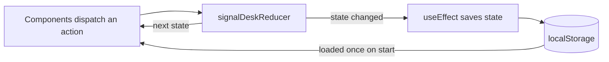

# SignalDesk

[](https://github.com/Taan1el/jobpulse/actions/workflows/ci.yml)
[](https://github.com/Taan1el/jobpulse/actions/workflows/pages.yml)
[](LICENSE)

SignalDesk is a technical signal planner. It tracks recurring skills and architecture themes, rates how well those themes support reference product profiles, and turns the gaps into a queue of projects to build. Everything runs in the browser and is saved to `localStorage`.

**Live demo:** [taan1el.github.io/jobpulse](https://taan1el.github.io/jobpulse/). The demo runs entirely in your browser: there is no backend, and your data stays on your device.


A short walkthrough of each part of the app is in [docs/demo.md](docs/demo.md).

## Features

- **Requirement signals**: filter by category, search skills and evidence, sort by mentions or name, and add a mention when a skill shows up again.
- **Reference profiles**: sample product profiles with their technical needs, a fit rating, and a note on what is missing.
- **Build queue**: tasks move from Next to In progress to Done and can be reopened. The header counts closed tasks.
- **Sample batch import**: merges three sample requirements once. Skills that are already tracked get one more mention and keep the text you wrote.
- **Add signal form**: inline validation for empty fields and for skills that are already tracked.
- **Connection states**: Ready, Loading, Empty, and Error views for a remote source. These are sample states; the app makes no network requests.
- **Export and reset**: download the current signals and tasks as JSON, or restore the sample data.

## Getting started

Requires Node.js 22.12 or newer (CI runs Node 24). No environment variables are needed.

```bash
npm install
npm run dev
```

This starts the Vite dev server at `http://localhost:5173`. There is nothing else to configure: no API, no database, no accounts.

## Scripts

| Command | What it does |
| --- | --- |
| `npm run dev` | Start the Vite dev server |
| `npm test` | Run the test suite once |
| `npm run lint` | Run oxlint |
| `npm run build` | Type-check and build for production |
| `npm run build:pages` | Type-check and build the static site for GitHub Pages (base path `/jobpulse/`) |
| `npm run preview` | Serve the production build |
| `npm run screenshots` | Capture desktop and mobile screenshots into `docs/screenshots/` |

`npm run screenshots` needs Playwright's Chromium. Install it once with `npx playwright install chromium`. Set `SCREENSHOT_PORT` to pin the throwaway server the script starts to a specific port instead of the next free one.

## How it works

- **State**: every change goes through a typed reducer ([src/state/signalDeskReducer.ts](src/state/signalDeskReducer.ts)) with one action per user intent. It is a pure function with its own unit tests.
- **Persistence**: [src/state/storage.ts](src/state/storage.ts) saves to `localStorage` and checks every saved signal and task before restoring them. Anything malformed falls back to the sample data instead of crashing the page.
- **Components**: presentational components live in [src/components](src/components). The signal form owns its field state and validation and passes a clean `NewSignal` up to the app.
- **Accessibility**: semantic landmarks, lists, and fieldsets; labelled controls; visible focus styles; status messages through a live region that stays mounted; form errors linked with `aria-describedby`; reduced-motion support. axe-core runs in the test suite, and oxlint's jsx-a11y rules run in CI.



### Project structure

```text
shared/signaldesk.ts       Domain types and sample data
src/App.tsx                Page layout, derived values, and event handlers
src/components/            Presentational components and the signal form
src/state/                 Reducer, storage, and their unit tests
src/App.test.tsx           Behavior tests through the UI
src/App.a11y.test.tsx      axe checks for the main screen states
scripts/                   Screenshot capture
docs/                      Walkthrough and screenshots
```

## Testing

Vitest and React Testing Library cover user-facing behavior: filtering, search, sorting, form validation, the build queue, sample batch import, export, reset, live-region announcements, and recovery from corrupted `localStorage` data. The reducer and storage module have separate unit tests for edge cases (duplicate imports, unknown enum values, id generation). axe-core checks the main screen states for accessibility violations.

```bash
npm test
```

37 tests across 4 files as of this release. Run `npm run lint` for static checks (oxlint, including jsx-a11y rules).

## Deployment

### GitHub Pages

`npm run build:pages` builds the static site with the `/jobpulse/` base path into `dist/`. The `pages.yml` workflow builds on every push to `master` and deploys once the repository is public. There is no server-side piece to deploy: the build is the whole app.

To check the build locally under its subpath:

```bash
npm run build:pages
npx vite preview --base /jobpulse/
# open the printed URL, for example http://localhost:4173/jobpulse/
```

## Design notes and limitations

- State lives in `localStorage` on one device and one browser profile. There is no sync, no accounts, and no server.
- The connection-state samples (Ready, Loading, Empty, Error) are static demonstrations of UI states. No network request is ever made.
- The reference profiles, signals, and tasks the app starts with are sample data, and the profile names are fictional.
- `src/state/storage.ts` is the one place persistence lives, which is the piece a real backend would replace.

## Roadmap

- Let users add and edit reference profiles instead of starting from the sample set.
- Extract the reusable UI pieces into a separate component library.
- Add optional schema validation on JSON import so a hand-edited file can be brought back in, not just exported.
- Let users rename or delete individual signals and tasks.

## License

MIT, see [LICENSE](LICENSE).
