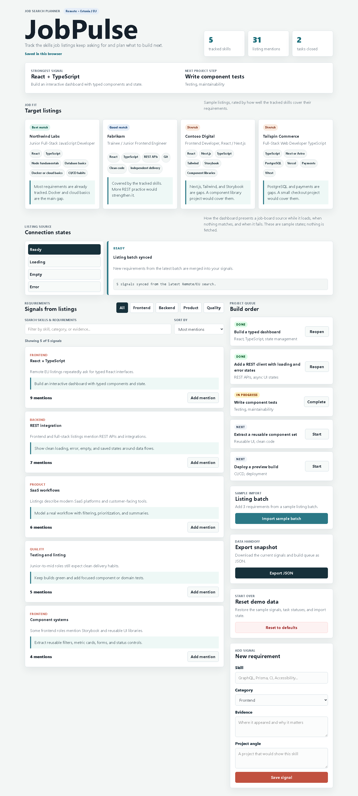
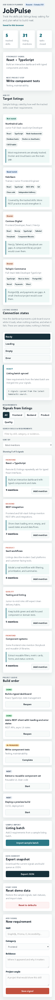

# SignalDesk Walkthrough

A short tour of the app.

## 1. Header and Focus Strip

The summary counts tracked skills, total signal mentions, and closed tasks. Below it, the focus strip shows the skill with the most mentions and the next unfinished task.

## 2. Reference Profiles

Four sample product profiles list their technical needs. The fit label and note on each card show how well the tracked skills support that profile.

## 3. Connection States

Pick Ready, Loading, Empty, or Error to see how the dashboard presents a remote source in each state. The Loading view shows a skeleton. These are sample states; nothing is fetched.

## 4. Requirement Signals

- Filter by category, search skills and evidence, or sort by mentions or name. The count above the list updates as the filters change.
- Add a mention on any card. The total in the header updates and the change is saved in `localStorage`.

## 5. Build Queue

Each task shows its status and a button for the next step: Start, Complete, or Reopen.

## 6. Import, Export, and Reset

- **Import sample batch** merges three sample requirements once. Importing again is blocked until the demo data is reset.
- **Export JSON** downloads the current signals and tasks.
- **Reset to defaults** restores the sample data.

## 7. Add a Signal

Submit the form empty, or with a skill that is already tracked, to see the inline errors. Focus moves to the first field that needs attention.

## Screenshots

### Desktop (1440px)

### Mobile (390px)

Regenerate them with `npm run screenshots` after installing Playwright's Chromium once with `npx playwright install chromium`.
